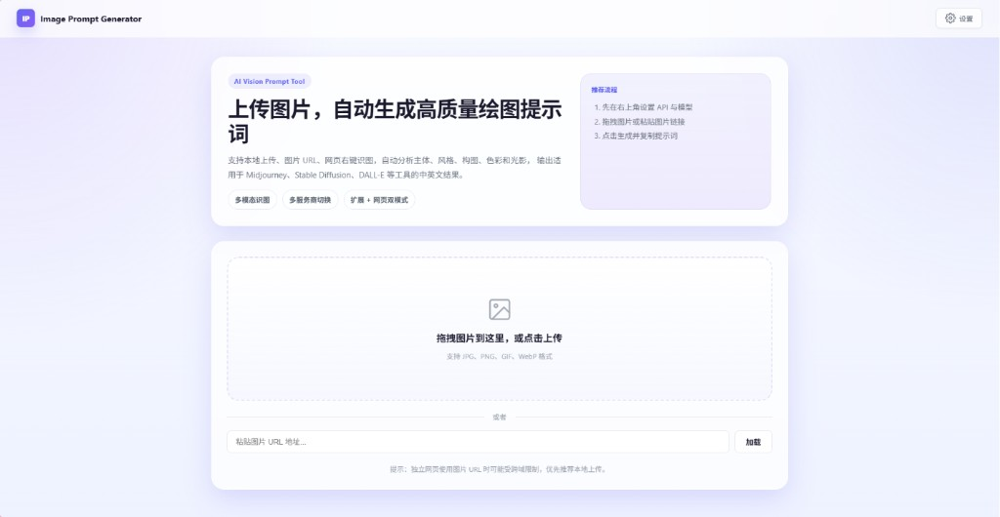
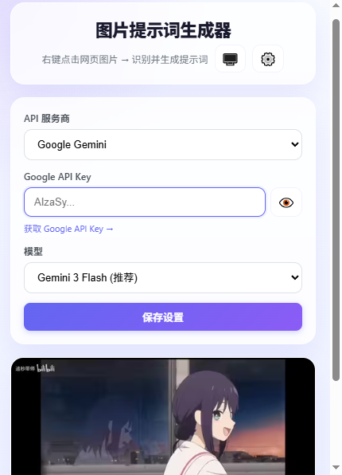

[English](README.md) | [简体中文](README.zh-CN.md) | [日本語](README.ja.md)

# Image Prompt Generator

An AI-powered multimodal image analysis and prompt generation tool. Upload or select an image, let AI analyze the subject, style, composition, lighting, and color palette, then generate prompts you can use directly with Midjourney, Stable Diffusion, DALL-E, and similar tools.

## Screenshots

### Standalone Web Mode



### Chrome Extension Popup



## Features

- **Multiple image inputs**: drag and drop, file picker, image URL, or right-click a web image
- **6 AI providers**: SiliconFlow, Google Gemini, Anthropic Claude, OpenAI, OpenCode Zen, and Vtrix
- **Rich model selection**: includes Gemini 3.1 Pro, Claude Opus 4.5, GPT-5.2, and more
- **Two usage modes**: Chrome extension and standalone web app
- **One-click copy**: quickly copy generated prompts to the clipboard
- **Multilingual UI**: supports English, Chinese, and Japanese with automatic browser-language detection

## Supported Providers

| Provider | Best for | API format |
|---|---|---|
| **SiliconFlow** | Recommended for users in China, includes free models | OpenAI-compatible |
| **Google Gemini** | High-quality multimodal understanding | Gemini API |
| **Anthropic Claude** | Reliable reasoning quality | Anthropic API |
| **OpenAI** | GPT-4o family | OpenAI API |
| **OpenCode Zen** | Aggregated multi-model access | OpenAI-compatible |
| **Vtrix** | Unified access to Gemini / Claude / GPT models | OpenAI-compatible |

## Usage

### Option 1: Standalone web app

Open `index.html` in your browser, then upload an image or paste an image URL.

### Option 2: Chrome extension

1. Open `chrome://extensions/`
2. Enable **Developer mode**
3. Click **Load unpacked** and select this project folder
4. Right-click any image on a web page and choose the prompt generation action
5. You can also open fullscreen upload mode from the extension popup

### Configure API key

On first use:

1. Open **Settings**
2. Choose an AI provider
3. Enter your API key
4. Select a model and save

## Project Structure

```text
Image-Prompt-Generator/
├─ Standalone web app
│  ├─ index.html      # Entry page
│  ├─ app.js          # UI logic and direct API calls
│  ├─ i18n.js         # Shared translations and language helpers
│  └─ style.css       # Web styles
├─ Chrome extension
│  ├─ manifest.json   # Extension manifest
│  ├─ background.js   # Service worker and API calls
│  ├─ popup.html      # Popup page
│  ├─ popup.js        # Popup logic
│  └─ popup.css       # Popup styles
├─ assets/
│  └─ screenshots/    # README screenshots
└─ README*.md         # Multilingual documentation
```

## Example Output

```text
[Summary]
This is an anime-style screenshot. On the right side of the frame is a young girl with dark purple hair and green eyes. She is wearing a white sailor-style uniform with red trim and looking back with a gentle smile. Outside the window is a dusk sky, and her faint reflection can be seen in the glass. The overall mood is soft and nostalgic.

[English Prompt]
anime style, a young girl with dark purple hair in a low bun, green eyes, smiling, looking back over her shoulder, wearing a white sailor uniform with red trim. She is indoors near a window. Outside the window is a dusk or twilight sky with orange and dark blue hues. The girl's faint reflection can be seen on the window glass. Soft lighting, nostalgic atmosphere, 2d animation, high quality, cinematic composition.
```

## Privacy

- API keys are stored only in the local browser environment (`localStorage` / `chrome.storage`)
- Image data is sent only to the selected AI provider during generation and is not stored by this tool

## License

MIT
